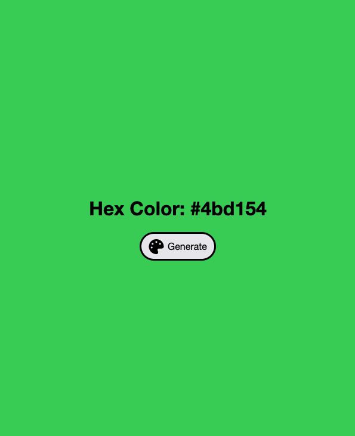
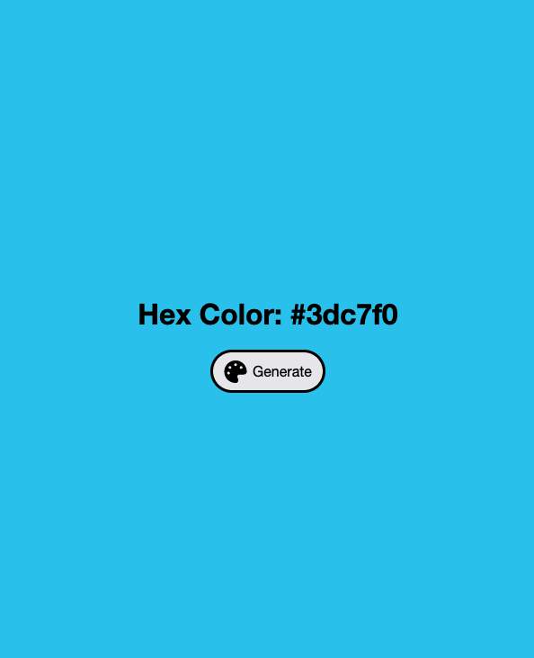

# Hex Change Background Color with JavaScript

JavaScript Project | Change background color and display color with hex number when the generate button is clicked.

## Table of Contents

- [Hex Change Background Color with JavaScript](#hex-change-background-color-with-javascript)
  - [Table of Contents](#table-of-contents)
  - [General Information](#general-information)
  - [Screenshots](#screenshots)
  - [Technologies](#technologies)
  - [Site Link](#site-link)
  - [What I Learned](#what-i-learned)
  - [Author](#author)

## General Information

This is Project #2 from [100+ JavaScript Projects for Beginners!](https://jsbeginners.com/javascript-projects-for-beginners/)
The project objectives is to make a random hex value created from an array of all the possible different hex values and concatenate 6 different values to a `string` that begun with the `#` character.

## Screenshots






## Technologies

- HTML
- CSS
- JavaScript

## Site Link

>**Live Site: [Change Background Color Site](https://vlorozco.github.io/hex-change-background-color/)**

## What I Learned

This was a fun mini project to create. It was created with flexbox to center the content and text in the center of the screen view. A column flex-direction was given to the container to stack the title and button vertically.

In this project, I learned how to use the `toString()` and `substring()` methods to convert characters into strings to use in developing a six-digit random hex color.

While researching, I have seen other solutions create the random hex manually creating a variable that contained an array of numbers from 0-9 and letters from A-F.
I came across a unique approach to attaining the same characters through a video by  [ZinoTrust Academy](https://www.youtube.com/watch?v=MrnzrbaCY7U&t=3667). He clearly breaks down how `Math.random()` returns a number, that must be converted `toString()` in order to use alpha characters in addition to numbers. This is done by adding the number 16 as a parameter to the `toString()`. He further explains that to return only the first six digits of the `Math.random()` method, a `substring()` is called to include only characters between index 2-6 of the returned string.

```js
const generateColor = () => {
  const randomColor = Math.random().toString(16).substring(2,8);
  document.body.style.backgroundColor = "#" + randomColor;
  hexValue.innerHTML = "#" + randomColor;
};

```

## Author

- Github - [Veronica L. Orozco](https://github.com/VLOrozco)
- Frontend Mentor - [@VLOrozco](https://www.frontendmentor.io/profile/VLOrozco)
- Codecademy - [orozcov3](https://www.codecademy.com/profiles/orozcoV3)
